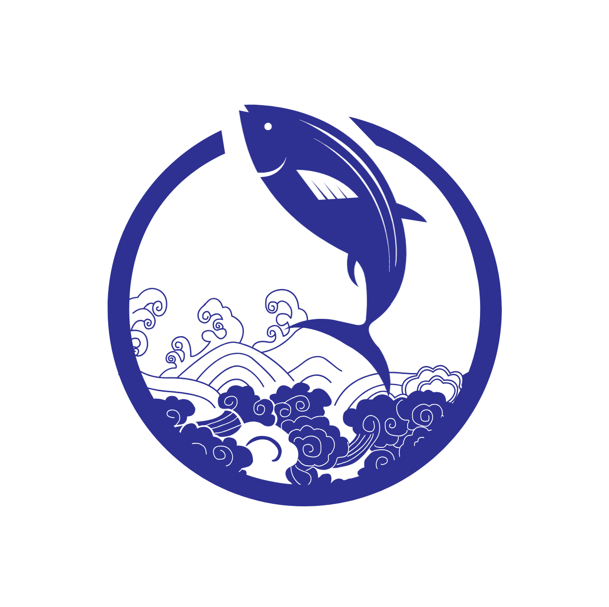

---------------------------------------------------------------------------------

## 这是个什么项目？

[简体中文](README.md) | [English](README.md)

当前，数字孪生、人工智能技术（AI）不断发展，传统水务水利行业的智能化转型趋势愈发明显。但是，想法和方案的实际落地，以及真正为用户提供价值的过程，仍然存在很多挑战。

**YunmengEnvs**，云梦环境，作为一个融合 CFD 和 AI 技术的环境流体力学模拟器和耦合框架，希望能帮助理解专业概念、数值方法和现实数据；希望能提供一个标准化的平台来尝试新想法、新技术和新方案。  

---------------------------------------------------------------------------------

## 如何使用？

---------------------------------------------------------------------------------

## 加入我们！  

我们希望能够做出一些有趣的尝试和成果，希望能够将这些想法和经验分享给整个社区。

如果你对这个项目感兴趣，欢迎加入我们！  
你的加入将是对我们最大的鼓励！ 

---------------------------------------------------------------------------------

## 更多

项目开发过程中受到启发和帮助的项目：

- [JAXFLUIDS](https://github.com/tumaer/JAXFLUIDS)

---------------------------------------------------------------------------------
